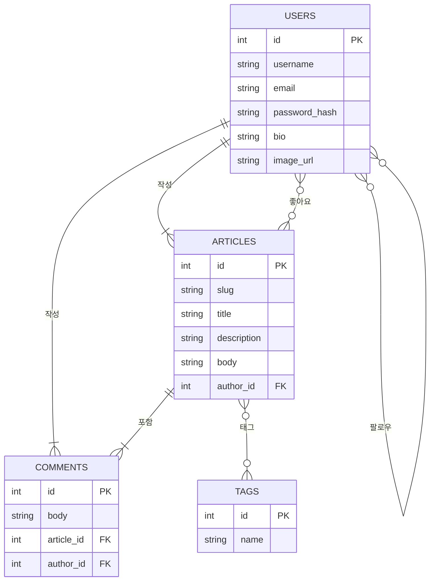

# Vibecoding RealWorld App: 디자인 문서

## 1. 개요

이 문서는 "Vibecoding RealWorld App" 프로젝트의 기술적인 설계와 아키텍처를 정의합니다. 프로젝트의 목표는 [RealWorld](https://gothinkster.github.io/realworld/) 표준 사양을 기반으로 Medium.com과 유사한 소셜 블로깅 플랫폼을 구현하며, 풀스택 개발 과정을 학습하는 것입니다.

이 문서는 PRD(제품 요구사항 문서)를 기반으로 시스템의 구조, 데이터베이스 스키마, API 설계, 그리고 프론트엔드 컴포넌트 구조를 구체화하는 것을 목표로 합니다.

## 2. 목표

- **표준 API 구현**: RealWorld 백엔드 API 명세를 완벽하게 준수하는 서버를 구축합니다.
- **기술 스택 학습**: React, Node.js(또는 Python), SQLite, shadcn/tailwind 등 최신 기술 스택을 활용하여 실제 애플리케이션을 개발하는 경험을 쌓습니다.
- **모듈식 아키텍처**: 프론트엔드와 백엔드를 명확하게 분리하여 상호 독립적으로 개발하고 확장할 수 있는 구조를 설계합니다.
- **클린 코드 및 테스트**: 유지보수하기 쉽고 테스트 가능한 코드를 작성하는 원칙을 적용합니다.

## 3. 기술 스택

- **프론트엔드**: React
- **백엔드**: Node.js (Express)
- **데이터베이스**: SQLite
- **스타일링**: shadcn/ui, Tailwind CSS
- **인증**: JWT (JSON Web Token)
- **실행 환경**: Docker

## 4. 시스템 아키텍처

### 4.1. 전체 시스템 구조

본 프로젝트는 클라이언트-서버 아키텍처를 따릅니다. 프론트엔드는 사용자 인터페이스를 담당하고, 백엔드는 비즈니스 로직과 데이터베이스 관리를 담당합니다. 둘 사이의 통신은 표준 REST API를 통해 이루어집니다.

```mermaid
graph TD
    subgraph "사용자"
        A[웹 브라우저]
    end

    subgraph "프론트엔드 (React)"
        B[UI 컴포넌트]
        C[상태 관리]
        D[API 클라이언트]
    end

    subgraph "백엔드 (Node.js/Express)"
        E[REST API Endpoints]
        F[비즈니스 로직 (서비스)]
        G[데이터 접근 계층 (ORM/DAO)]
    end

    subgraph "데이터베이스"
        H[SQLite]
    end

    A -- HTTP/HTTPS --> B
    B -- 상호작용 --> C
    C -- API 요청 --> D
    D -- REST API (JSON) --> E
    E -- 호출 --> F
    F -- 데이터 요청 --> G
    G -- SQL --> H
```

### 4.2. 데이터베이스 스키마 (ERD)

애플리케이션의 핵심 데이터 모델은 사용자, 글, 댓글, 태그입니다. 각 모델 간의 관계는 다음과 같습니다.



**관계 설명:**
- **Users ↔ Articles**: 한 명의 사용자는 여러 개의 글을 작성할 수 있습니다. (1:N)
- **Users ↔ Comments**: 한 명의 사용자는 여러 개의 댓글을 작성할 수 있습니다. (1:N)
- **Articles ↔ Comments**: 한 개의 글에는 여러 개의 댓글이 달릴 수 있습니다. (1:N)
- **Users ↔ Users (Follows)**: 사용자는 다른 사용자를 팔로우할 수 있습니다. (M:N, 중간 테이블 `Follows` 필요)
- **Users ↔ Articles (Favorites)**: 사용자는 여러 글에 '좋아요'를 표시할 수 있습니다. (M:N, 중간 테이블 `Favorites` 필요)
- **Articles ↔ Tags**: 한 개의 글은 여러 개의 태그를 가질 수 있고, 하나의 태그는 여러 글에 사용될 수 있습니다. (M:N, 중간 테이블 `ArticleTags` 필요)

## 5. API 엔드포인트 설계

RealWorld 표준 API 명세를 따릅니다. 주요 리소스별 엔드포인트는 다음과 같습니다.

- **`Authentication`**
  - `POST /api/users/login`: 로그인
  - `POST /api/users`: 회원가입
- **`User and Profile`**
  - `GET /api/user`: 현재 로그인된 사용자 정보 조회
  - `PUT /api/user`: 사용자 정보 수정
  - `GET /api/profiles/:username`: 특정 사용자 프로필 조회
  - `POST /api/profiles/:username/follow`: 사용자 팔로우
  - `DELETE /api/profiles/:username/follow`: 사용자 언팔로우
- **`Articles`**
  - `GET /api/articles`: 글 목록 조회 (페이지네이션, 필터링 지원)
  - `GET /api/articles/feed`: 팔로우하는 사용자들의 글 목록 조회
  - `POST /api/articles`: 새 글 생성
  - `GET /api/articles/:slug`: 단일 글 조회
  - `PUT /api/articles/:slug`: 글 수정
  - `DELETE /api/articles/:slug`: 글 삭제
- **`Comments`**
  - `GET /api/articles/:slug/comments`: 특정 글의 댓글 목록 조회
  - `POST /api/articles/:slug/comments`: 댓글 추가
  - `DELETE /api/articles/:slug/comments/:id`: 댓글 삭제
- **`Favorites`**
  - `POST /api/articles/:slug/favorite`: 글 '좋아요'
  - `DELETE /api/articles/:slug/favorite`: 글 '좋아요' 취소
- **`Tags`**
  - `GET /api/tags`: 모든 태그 목록 조회

## 6. 프론트엔드 컴포넌트 설계

`shadcn/ui`와 `Tailwind CSS`를 사용하여 재사용 가능한 컴포넌트 기반으로 UI를 구축합니다.

- **Layout Components**:
  - `Header`: 로고, 네비게이션 링크(홈, 새 글, 설정), 사용자 프로필 링크/로그인/회원가입 버튼 포함.
  - `Footer`: 저작권 및 프로젝트 정보 표시.
- **Page Components**:
  - `HomePage`: 글 목록과 태그 목록을 보여주는 메인 페이지.
  - `ArticleDetailPage`: 글 본문, 작성자 정보, 댓글 목록을 보여주는 페이지.
  - `EditorPage`: 새 글을 작성하거나 기존 글을 수정하는 페이지.
  - `SettingsPage`: 사용자 정보(이메일, 비밀번호, 자기소개 등)를 수정하는 페이지.
  - `ProfilePage`: 특정 사용자의 프로필 정보와 해당 사용자가 작성한 글 목록을 보여주는 페이지.
  - `AuthPage`: 로그인/회원가입 폼을 제공하는 페이지.
- **Shared Components**:
  - `ArticleList` / `ArticlePreview`: 글 목록 및 개별 글 미리보기를 렌더링.
  - `CommentList` / `Comment`: 댓글 목록 및 개별 댓글.
  - `TagList`: 클릭 가능한 태그 목록.
  - `Pagination`: 페이지네이션 컨트롤.
  - `FollowButton`: 팔로우/언팔로우 버튼.
  - `FavoriteButton`: 좋아요/좋아요 취소 버튼.

## 7. 구현 계획

1.  **프로젝트 초기 설정**: 프론트엔드(React), 백엔드(Node.js) 프로젝트 구조 설정 및 의존성 설치.
2.  **데이터베이스 설계 및 마이그레이션**: `sequelize` 또는 `prisma` 같은 ORM을 사용하여 모델 정의 및 스키마 생성.
3.  **인증 기능 구현**: JWT 기반 회원가입, 로그인, 사용자 정보 관리 API 구현.
4.  **프로필 및 팔로우 기능 구현**: 프로필 조회, 팔로우/언팔로우 API 구현.
5.  **글/태그 기능 구현**: 글 CRUD 및 태그 관련 API 구현.
6.  **댓글 기능 구현**: 댓글 CRUD API 구현.
7.  **좋아요 기능 구현**: 좋아요/좋아요 취소 API 구현.
8.  **프론트엔드 레이아웃 및 페이지 구현**: 기본 레이아웃과 핵심 페이지 컴포넌트 개발.
9.  **API 연동**: 프론트엔드 상태 관리 로직을 구현하고 백엔드 API와 연동.
10. **스타일링 및 UI 개선**: `shadcn/ui`와 `Tailwind CSS`를 사용하여 전체적인 디자인 완성.
11. **테스트 및 배포**: 단위/통합 테스트 작성 및 Docker를 이용한 배포 준비.